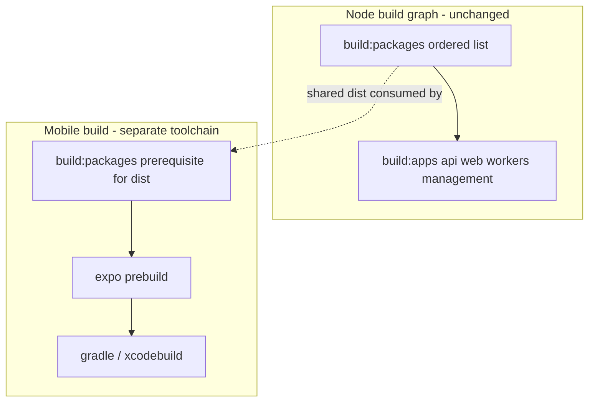
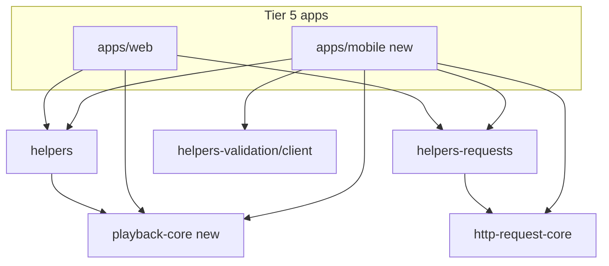
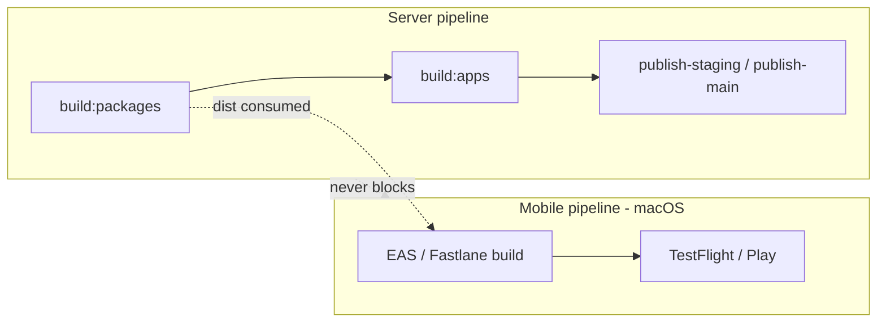

# Monorepo target structure for mobile

This proposal describes the **target** monorepo structure and the structural changes needed to add
`apps/mobile` (React Native / Expo prebuild) without disrupting the server/web build or CI. It builds
on the assessment in
[DOCS-MOBILE-MONOREPO-CURRENT-STATE.md](DOCS-MOBILE-MONOREPO-CURRENT-STATE.md).

This is a proposal. No production code is changed by this document.

## 1. Recommendation summary

- **Isolated `apps/mobile` workspace.** Auto-enrolls in `npm install` via the `apps/*` workspace
  glob in [package.json](/package.json), but stays **off** the Node build graph (`build:packages`,
  `build:apps`).
- **Shared packages only downward.** Mobile is a Tier 5 consumer (alongside `web`) in the
  architecture graph ([.llm/context/architecture.md](/.llm/context/architecture.md),
  [architecture-tier-dependencies](/.cursor/rules/architecture-tier-dependencies.mdc)). It may import
  lower-tier packages; nothing lower-tier may import mobile.
- **Extract one new package** (`packages/playback-core`) so playback/queue policy is shared instead
  of duplicated.
- **Add a Tier D** for `apps/mobile/**` import specifiers (Metro).
- **Separate CI track** (macOS) that never blocks server publish workflows.
- **No repo split, no `@podverse/ui` on mobile, no ORM on mobile.**

## 2. Target directory layout

```
apps/
  mobile/
    package.json              # mobile-only deps (expo, react-native, track-player, ...)
    app.json / app.config.ts  # Expo config (prebuild)
    metro.config.js           # monorepo resolver + watchFolders
    tsconfig.json             # extends base; jsx react-native; bundler resolution
    eslint.config.* (or root override)
    src/
      screens/                # RN screens (mirror web routes; behavior, not SCSS)
      navigation/             # tab + stack navigators
      hooks/                  # RN hooks (queue, auto-queue, playback wiring)
      bridge/                 # NativePlaybackBridge (parallels useMediaElementBridge)
      state/                  # Account/Queue/AutoQueue/MediaPlayer providers (RN)
      storage/                # secure token storage, prefs, downloads metadata
    ios/                      # native iOS project (CarPlay scene lives here)
      Pods/                   # generated (gitignored + cursorignored)
    android/                  # native Android project (Android Auto service)
      .gradle/  build/        # generated (gitignored + cursorignored)
    modules/                  # native modules: car/audio bridge, downloads
    e2e/                      # Maestro/Detox flows (NOT Playwright)
    APPS-MOBILE.md            # contributor + agent guide
    AGENTS.md                 # LLM entrypoint
```

The native car/audio layer under `ios/`, `android/`, and `modules/` implements the background
playback service and the CarPlay/Android Auto surfaces described in
[initial-decisions/DOCS-MOBILE-CARPLAY-ANDROID-AUTO.md](/docs/proposals/mobile/initial-decisions/DOCS-MOBILE-CARPLAY-ANDROID-AUTO.md).

## 3. `packages/playback-core` proposal

The largest structural opportunity: the playback **policy** is pure TS but currently lives in
`apps/web/src/lib/playback/`. Extract it so web and mobile share one decision engine and the native
car cache uses the same semantics.

### What moves

| Source (web) | Destination (`packages/playback-core`) |
| --- | --- |
| `apps/web/src/lib/playback/resolvePlaybackLoadDecision.ts` | `src/resolvePlaybackLoadDecision.ts` |
| `apps/web/src/lib/playback/playbackTarget.ts` | `src/playbackTarget.ts` |
| `apps/web/src/lib/playback/playbackLoadRequest.ts` | `src/playbackLoadRequest.ts` |
| `apps/web/src/lib/playback/playbackTargetFromStandardLoad.ts` | `src/playbackTargetFromStandardLoad.ts` |
| `resumeSeekFromAbridged.ts`, `clampNearEndSeconds.ts`, `parsePlaybackSeconds.ts` | `src/` |
| `resolveEnclosureSwitchPlaybackDecision.ts`, `stageEnclosureSwitchFromSelection.ts` | `src/` |
| `apps/web/src/lib/queue/combineQueueNowPlayingAndUpcoming.ts` | `src/combineQueueNowPlayingAndUpcoming.ts` |
| `apps/web/src/lib/playback/__tests__/`, `lib/queue/__tests__/` | `src/__tests__/` |

### What stays put

React hooks, contexts, and the DOM bridge stay in `apps/web` (`useMediaElementBridge`,
`MediaPlayerControls`, `NonLiveMediaOrchestrator`). Mobile adds parallel RN hooks that call the same
pure functions.

### Tier placement

`packages/playback-core` depends on `@podverse/helpers` only (for DTOs like
`QueueResourcesAbridgedIndex`). That makes it Tier 2 in
[.llm/context/architecture.md](/.llm/context/architecture.md) (depends on Tier 1 `helpers`). Add it
to the `build:packages` ordered list **after** `helpers`.

### Phased migration (later, not in this doc)

1. Create `packages/playback-core` with package.json (`main: dist/index.js`, like
   [packages/helpers/package.json](/packages/helpers/package.json)).
2. Move files + tests; fix imports to `.js` NodeNext specifiers (Tier A).
3. In `apps/web`, replace `src/lib/playback` internals with re-exports from
   `@podverse/playback-core` (keep web import paths stable, or update call sites).
4. Add to `build:packages` after `helpers`; run unit tests.
5. Mobile consumes `@podverse/playback-core` once it exists.

## 4. Tier D — `apps/mobile/**`

Metro resolves `.ts`/`.tsx` natively (extensionless, like Tier B/C) and reads **built `dist/`** from
Tier A packages via workspace symlinks. So mobile **app source** uses extensionless imports, and it
consumes `@podverse/*` packages through their published `main`/`types` (`dist/`), not their source.

Add **Tier D** to the documented tier system:

| Tier | Locations | Import style |
| --- | --- | --- |
| A | `packages/*` (except ui), api, workers, sidecars, tools | NodeNext `.js` |
| B | `apps/web/src`, `apps/management-web/src` | extensionless |
| C | `packages/ui`, `packages/integrations-web` | extensionless |
| **D (new)** | `apps/mobile/**` | extensionless; consumes Tier A `dist/` |

Documents/configs to update when implementing:

- [docs/development/tooling/DOCS-DEVELOPMENT-TOOLING-IMPORT-SPECIFIERS.md](/docs/development/tooling/DOCS-DEVELOPMENT-TOOLING-IMPORT-SPECIFIERS.md)
- [.cursor/skills/import-specifiers-tiered/SKILL.md](/.cursor/skills/import-specifiers-tiered/SKILL.md)
- [eslint.config.mjs](/eslint.config.mjs) — add an `apps/mobile/**` override (extensionless + RN
  globals), parallel to the existing `apps/web/src` blocks.

Do **not** codemod Tier A packages for Metro; keep them on NodeNext for the Node apps.

## 5. Workspace and root `package.json`

- `apps/mobile` is already covered by the `apps/*` workspace glob in [package.json](/package.json);
  no workspaces change strictly required (the explicit sidecar entries are the only special cases).
- **Do not** add `apps/mobile` to `build:packages` or `build:apps`.
- Mobile dependencies live in `apps/mobile/package.json` only, to limit root lockfile churn.
- Optional convenience scripts (kept off the build graph):

  ```json
  {
    "scripts": {
      "dev:mobile": "npm run start -w apps/mobile",
      "mobile:ios": "npm run ios -w apps/mobile",
      "mobile:android": "npm run android -w apps/mobile"
    }
  }
  ```

- `build:packages` must include `playback-core` after `helpers` once extracted.

## 6. Build order diagram



Mobile depends on built `dist/` from `build:packages`, but otherwise runs its own commands. A broken
native build never blocks `build:apps`.

## 7. Test and lint isolation

- **Unit:** mobile may use Vitest; `packages/playback-core` tests run in the normal `test:unit`
  sweep. The mobile **app** workspace should be **excluded** from root `test:unit` (which is
  `--all --exclude apps/api --exclude apps/management-api` in [package.json](/package.json)) until
  its RN test config is stable — add `--exclude apps/mobile`.
- **Lint:** add an `apps/mobile/**` ESLint override; until configured, scope it out of the root
  `lint` summary run.
- **E2E:** mobile uses Maestro/Detox, **not** Playwright. Do not route mobile E2E through
  `make e2e_test_*`; keep it in `apps/mobile/e2e/`. See
  [end-with-targeted-make-report-verify](/.cursor/rules/end-with-targeted-make-report-verify.mdc)
  (those make targets are web/management-web only).

## 8. Metro monorepo configuration

`apps/mobile/metro.config.js` must:

- Set `watchFolders` to the repo root so Metro can resolve hoisted `@podverse/*` symlinks and shared
  deps (axios, uuid, date-fns).
- Configure `resolver.nodeModulesPaths` for the workspace layout (mobile `node_modules` + root
  `node_modules`).
- Resolve `@podverse/*` to each package's `main` (`dist/index.js`) — see
  [packages/helpers/package.json](/packages/helpers/package.json) (`"main": "dist/index.js"`).

**Operator requirement:** run `npm run build:packages` before mobile dev/build so the consumed
`dist/` exists. (Alternatively, a later iteration could transpile Tier A from source via Metro, but
that fights NodeNext `.js` specifier semantics — not recommended initially.)

## 9. CI workflows (proposal)

- Add **separate macOS GitHub Actions** jobs for mobile build/submit (EAS or Fastlane) targeting
  TestFlight (iOS) and Play closed testing (Android).
- These run on the same branches but are **independent** of `publish-staging.yml` /
  `publish-main.yml`; a slow or failed mobile build must not block server image promotion, and vice
  versa.
- Version fan-out: [scripts/publish/bump-version.sh](/scripts/publish/bump-version.sh) bumps all
  workspaces; mobile inherits the marketing version while CI supplies a monotonic build number. See
  [DOCS-MOBILE-VERSIONING-RELEASE.md](/docs/proposals/mobile/initial-decisions/DOCS-MOBILE-VERSIONING-RELEASE.md).

## 10. i18n target options

Web sources live under `apps/web/i18n/originals/` (`en-US`, `es`, `fr`, `el-GR`); the runtime is
`next-intl` (not usable on mobile). Options for mobile string reuse:

| Option | Pros | Cons | Recommendation |
| --- | --- | --- | --- |
| **Shared `packages/i18n-catalog`** | Single source of truth; one translate pipeline | Refactor web/management paths + CI | **Preferred** medium-term |
| Symlink web originals into mobile | Fast | Fragile across platforms/CI | Avoid |
| Copy originals + CI key-parity check | Simple start | Drift risk; needs a check | Acceptable for v1 spike |

Recommendation: start by **copying** originals for the Phase 1 spike, then promote to a shared
`packages/i18n-catalog` when mobile stabilizes. Mobile uses a RN-compatible runtime (`i18next` /
`react-intl` / `expo-localization`). Duration formatting reuses `@podverse/helpers`
(`lib/i18n/timeFormatter.ts`).

## 11. Change magnitude

| Work item | Magnitude |
| --- | --- |
| Add `apps/mobile` Expo prebuild skeleton | Medium |
| Extract `packages/playback-core` | Medium |
| Tier D docs + ESLint override | Small |
| `.cursorignore` native excludes | Small |
| Root `test:unit` / `lint` exclusions | Small |
| Metro monorepo config | Medium |
| Separate macOS CI workflows | Medium |
| i18n shared catalog (later) | Medium |

## 12. What we are NOT doing

- **Not** splitting into a separate repo (monorepo decision stands —
  [initial-decisions/DOCS-MOBILE-MONOREPO-DECISION.md](/docs/proposals/mobile/initial-decisions/DOCS-MOBILE-MONOREPO-DECISION.md)).
- **Not** importing `@podverse/ui` into mobile (web-only: Next/SCSS/react-dom).
- **Not** importing `@podverse/orm`, `parser`, `mq`, `helpers-backend/browser/config` into mobile.
- **Not** adding mobile to the Node `build:packages` / `build:apps` critical path.
- **Not** routing mobile E2E through web `make e2e_*` targets.

## Diagram: target package graph



## Diagram: build/CI isolation


