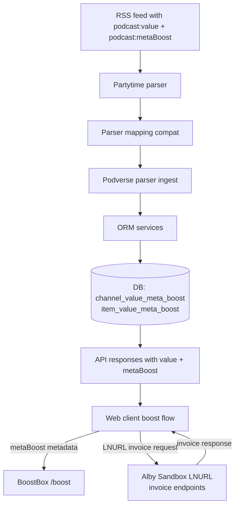

# V4V MetaBoost Flow

This diagram shows how V4V and `<podcast:metaBoost>` data moves from RSS ingestion through
Podverse parsing and storage, into API responses, and finally into the web boost flow with
client-side calls to BoostBox and Alby Sandbox.

