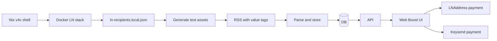
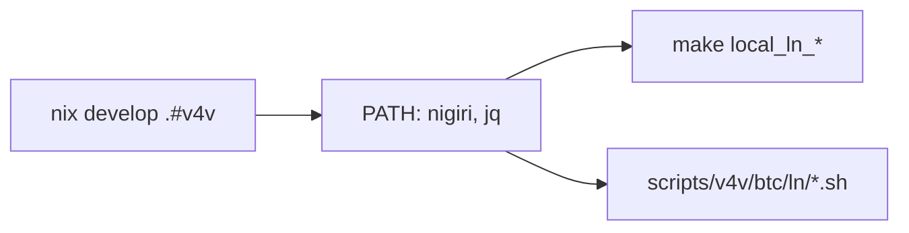
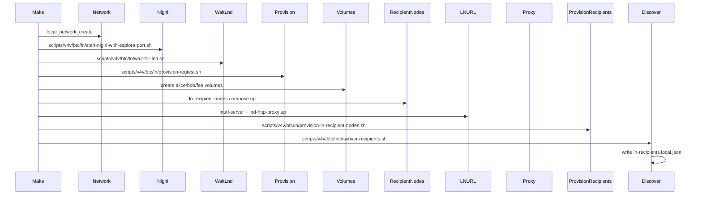
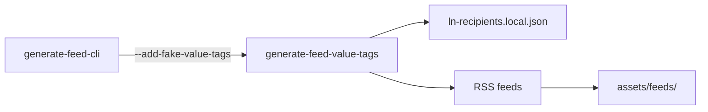
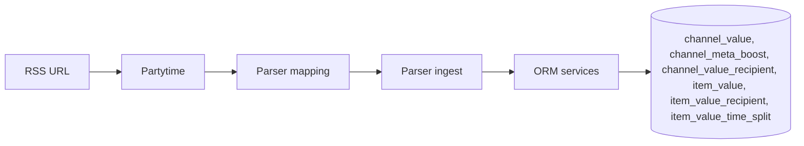
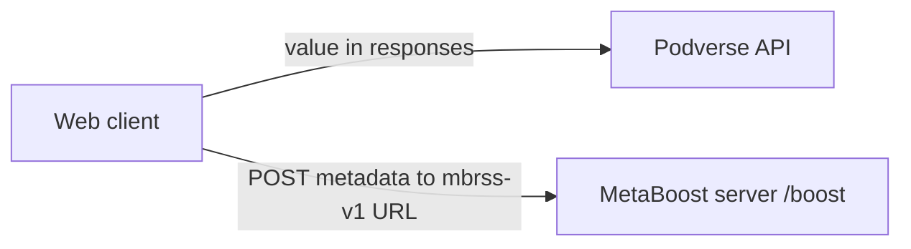
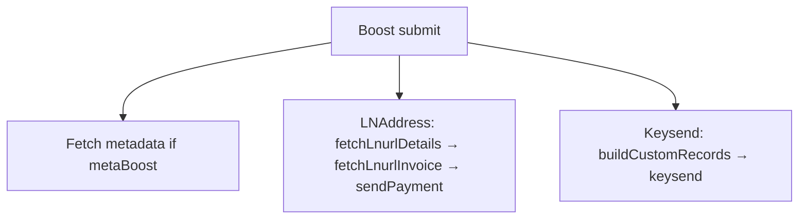

# Bitcoin LN Setup and Integration Diagram

This document explains the full Bitcoin Lightning (V4V) pipeline: Nix and Docker local infra,
test asset generation, RSS parsing and storage, and the web app boost flow for both **LNAddress**
and **node/keysend** implementations.

## Diagram index

1. [High-level E2E flow](#high-level-e2e-flow)
2. [Nix environment](#nix-environment)
3. [local_ln_up sequence](#local_ln_up-sequence)
4. [Local stack (ports)](#local-stack-ports)
5. [Test asset generation](#test-asset-generation)
6. [Parsing and storage](#parsing-and-storage)
7. [API and MetaBoost metadata](#api-and-metaboost-metadata)
8. [Web app: Boost and payment paths](#web-app-boost-and-payment-paths)

---

## High-level E2E flow

---

## Nix environment

The root flake exposes `devShells.v4v` and `v4v-fish` using `nix/v4v.nix`. That module adds
**Nigiri** (pre-built binary from GitHub) and **jq** to the dev shell; the default shell does
not include Nigiri.

Script paths: `scripts/v4v/btc/ln/*.sh` (and `lnd-http-proxy.js` in the same directory). Docker compose files: `infra/docker/local/v4v/bitcoin/lnd/lnurl-server/`, `ln-recipient-nodes/`, `lnd-http-proxy/`.

---

## Docker and local Lightning infra

### local_ln_up sequence

`makefiles/local/Makefile.local.v4v.mk` (included via makefiles/local/Makefile.local.infra.mk) defines
`local_ln_up`. The sequence:

### Local stack (ports)

| Service / component | Port(s)                          | Notes                                      |
| ------------------- | -------------------------------- | ------------------------------------------ |
| Esplora             | 8282                             | Block explorer                             |
| Bitcoin Core        | 18443 (RPC)                      | Regtest                                    |
| LND (Nigiri)        | 18080 REST, 10009 gRPC, 9735 P2P | Main sender node (Alby connects via proxy) |
| LND HTTP Proxy      | 8181                             | Injects macaroon; use for Alby             |
| Core Lightning      | 9835 / 9935 P2P                  | CLN                                        |
| Chopsticks          | 3030                             | Faucet                                     |
| Electrs             | 60001                            | Electrum server                            |
| LNURL Server        | 3003                             | alice@localhost:3003 etc.                  |
| LND recipient alice | 18081 REST                       | Keysend recipient only                     |
| LND recipient bob   | 18082 REST                       | Keysend recipient only                     |
| LND recipient fee   | 18083 REST                       | Keysend recipient only                     |
| MetaBoost server    | 8080                             | Optional local metadata endpoint           |

`discover-recipients.sh` reads pubkeys from `podverse_local_lnd_alice`, `podverse_local_lnd_bob`,
and `podverse_local_lnd_fee` via `lncli --network=regtest getinfo`, and writes
`tools/test-assets/config/ln-recipients.local.json` with `keysend` (address = pubkey) and
`lnaddress` (address = `user@localhost:3003`). That file is the bridge from Docker LN to test
asset generation.

---

## Test asset generation

- **Entrypoint:** `npm run generate -w tools/test-assets -- --add-fake-value-tags` (or
  `podverse-test-assets`). Optional: `generate_and_parse` to also populate the DB.
- When `--add-fake-value-tags` is set, the CLI uses `@podverse/v4v-btc-ln/test-data`
  (`readLocalLnRecipientsConfig`, `LNURL_TEST_ADDRESSES`, `VALUE_RECIPIENT_SPLITS`, `METABOOST_URL`)
  to read `ln-recipients.local.json` (or fall back to built-in fake data) and emits RSS with a
  channel-level `<podcast:metaBoost>`, plus `<podcast:value>` blocks that contain
  `<podcast:valueRecipient>` children; each value block can mix `type="node"` and `type="lnaddress"`
  recipients.

Output: feeds under `tools/test-assets/assets/feeds/`, served at `http://localhost:2111/feeds/`.
Value tags reference real local keysend pubkeys and LNURL addresses so E2E payments work.

---

## Parsing and storage

RSS feed URL → **Partytime** (podverse-partytime) parses XML → `FeedObject` with channel `values`,
channel `metaBoost`, item-level value data, and related fields. **Parser-mapping**
(`compat/partytime/channel`, `value`, `item`) produces compat DTOs. **Parser** ingest
(`handleParsedChannelMetaBoost`, `handleParsedChannelValue`, item value handlers) → **ORM** services →
**DB**.

See [V4V-METABOOST-FLOW.md](V4V-METABOOST-FLOW.md) for the metaBoost-focused diagram.

---

## API and MetaBoost metadata

- V4V value recipients map to channel/item value rows; channel `<podcast:metaBoost>` maps to
  `channel_meta_boost` on the channel in API payloads (same relation name as ORM).
- The web client posts metadata directly to the mbrss-v1 endpoint URL from `<podcast:metaBoost>`.

---

## Web app: Boost and payment paths

- **When Boost is shown:** Channel has value data; `BoostForm` uses `useBoostSelection`,
  `useBoostRecipients`, and `useBoostPayments`.
- **MetaBoost:** If present, client fetches metadata from the mbrss-v1 URL; `desc` is used as
  LNURL comment (LNAddress) or bLIP-0010 message (keysend). If metadata fetch fails, "Pay Anyway"
  sends without message.

### LNAddress (type="lnaddress")

LNURL-pay: resolve Lightning Address → fetch invoice (optional comment = metadata `desc`) →
WebLN `sendPayment(invoice)`. Implemented in `@podverse/v4v-btc-ln` and
`@podverse/external-services-alby` (dev).

### Keysend (type="node")

Build bLIP-0010 / metaBoost payload → `buildCustomRecords` (TLV 7629169) → WebLN `keysend({
destination, amount, customRecords })`. No invoice.

---

## References

- [LOCAL-LIGHTNING.md](LOCAL-LIGHTNING.md) — Nigiri, ports, troubleshooting
- [LOCAL-V4V-TESTNET-WALKTHROUGH.md](LOCAL-V4V-TESTNET-WALKTHROUGH.md) — Step-by-step Nix to boost
- [V4V-METABOOST-LNURL.md](V4V-METABOOST-LNURL.md) — MetaBoost, LNURL, keysend/LNAddress behavior
- [V4V-METABOOST-FLOW.md](V4V-METABOOST-FLOW.md) — Data flow diagram
- [TOOLS-TEST-ASSETS.md](/tools/test-assets/TOOLS-TEST-ASSETS.md) — Test asset tool
